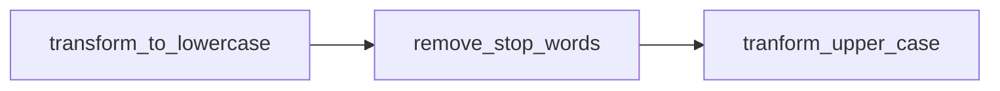

!!! info
    All your projects are prefixed with `atk-training-yourname-wf-`. All your commands will be prefixed with `atk-yourname-wf-`. We will not repeat this info in each project. We will specify only suffix. All the code should be checked in as specified in [previous](../) section.  All the packages and commands must be checked into dev-pypi.


## Record processing

One of the standard problems in computers is processing of files. The files can be CSV to be processed and put in the databases. Or, it can be tweets to be processed to be put in the database. We are going to build up to a system that does it with the following:

1. It should be reusable: People should be able to use it as a command, as a library, and as a framework.
3. It should be extendible: People should be able add new kinds of processing to the system, without having to learn all about it.
3. It should be customizable: People should be able to customize the processing.
4. It should be maintainable: People should be able to update the system. And, understand the system from documentation.

### Step 1: Basic record processing

Project name: `basic`. Command name: `basic` (remember the prefixes).

Your task is to write a function called `upper_case` in the file `processing_functions.py`. It processes a line at a time in a file. Each line is changed to upper case and written to another file. It should take the input filename as an argument, and optionally the output filename as well. If the output filename is not given, it adds filename.processed and produces it. Write that function, with the following guidelines:

!!! info
    * Keep the library in a separate file called `processing_functions.py`. That is, the following should be possible.
    ``` 
    from atk_training_yourname_wf_basic import processing_functions as functions
    functions.upper_case("Here is the text to be uppercased")
    ```
    * Keep the code that uses typer (a command line function) in a separate file, say `commands.py`.
    * Use `pyproject.toml` to define your script. Use `typer` to parse command line args.

Install command `atk-yourname-wf-basic` and test it.

### Step 1.5: Extending functionality of the processing

The earlier library is too simple. It does one task and only one task. What if we want to add more functions? 

Now add the following functions to the earlier processing functions. We are not going to create a new project or new command. Just add to the `processing_functions.py`:

1. `remove_stop_words`: It removes all the words `"a", "an", "the", "and" "or"` (assume that you are getting the words in lowercase -- silly, but that is not the point). To make the problem simpler, let us assume that the text does not contain any punctuation -- and the words are separated by just simple space. Simply put, you can do split to get words and remove the stop words and join them to get the result.
2. `capitalize`: Capitalizes the words in the file.
3. `fetch_geo_ip`: Assume that the record is an IP number. Using the simple call to `https://ipinfo.io/{ip_number}/geo` and get the json and dump out the return city, region, and country in comma separated values.
4. `lower_case`: Just like upper case, but lower case.
5. `uk_to_us`: Use regular expressions to convert any word ending with `sation` to `zation`, in lower case. 


Note that all these functions are `str->str`. Now, bump up the version with `poetry version 0.2.0` command and publish the package. We will use this library in all our subsequent code.

### Step 2: Customizing the application

Project name: `dynamic`. Command name: `dynamic`
Suppose you want to do the following:



How do you write it? You could, of course, use three python programs. Or, better yet, do all of it in python. Do the following:

1. Use a yaml file (an alternative to json) that specifies the following
```yaml
pipeline:
   - lowercase
   - remove_stop_words
   - uk_to_us
   - upper_case
```
1. Read this yaml file and use it to execute the pipeline on each record.

3. Here is the pseudocode
```
for each record:
   for each function f in the pipeline:
      record=f(record)
write the record
```
4. Do not do if-then-else. Use lookups to map function name to function.
5. In your readme.md, provide a sample yaml file for users to test your command. 

### Step 2.5: Learning iterators

Name: `stream`. command: `stream`

All these functions take a single record and produce a single record. However, what if they produce multiple records? Or, take multiple and produce single records? Or, take multiple and produce multiple records? Or, use the state in producing records?

To write these functions, we use iterators. Here is an exercise to learn about iterators. You do not have to check this code in. It is for you to learn.

1. Write a function called `fibonacci` that keeps on producing all fibonacci numbers -- an infinite sequence. 
2. Write a program that uses this function that skips the first 10 and then prints the 10 next fibonacci numbers and exits.
3. Write a function called `str_range(n)` that produces `n` strings in a stream, with "line number {i}" i replaced with the current number.
4. Write a program that uses this str_range to iterate over the first 20 strings to print them out.
5. Write a function that takes a file name and produces a stream of records. Hint: You can use fileinput module.

> Hint: Use yield, instead of return.Your code will resume from there from next call. In essence it produces a series of numbers, computing only when ask for it, say in a for loop.

Now that you are familar with `yield`, we are ready for the next step.

### Step 2.75: Steam functions

So far, all our functions have one property: They take a record and produce a record. What if we want to write a different kind of functions? 

We want you to write the following functions in the original `basic` module under the name `stream_functions.py`: All these functions take the type `Iterator[str]` and return the same type.

1. `number_the_lines` adds the line number as a prefix to each line.
2. `coalesce_empty_lines` removes multiple empty lines and produces only one empty line.
3. `remove_empty_lines` removes any empty lines.
4. `remove_even_lines` removes all the even numbered lines
5. `break_lines` breakes up a single long line into short (say length of 20) lines.

Now that you have these in the basic stream functions, please bump up the version number and publish to dev-pypi.

### Step 3: Using iterators for pipelines

Name: `dynamic-streaming`. Command: `process-stream` 

Now, we are going to swtich to using streaming functions in our pipelines. Since we already implemented the yaml file reading etc, now write a different program that uses both the packages that you wrote earlier: stream_functions.py and yaml_reader.

Implement the following pipeline, with your configuration. 


Importance is given to reuse of your own existing modules.

### Step 3.5: Adapter functions
Extend the previouis
This works well so far -- we are able to create nice streaming pipelines. But, we already wrote some functions earlier that process each string at a time. How do we reuse it? Here is the task:

Instead of rewriting, ensure that we can reuse the old functions. That is, write a function that does the following:
``` py linenums="1"
StringFuncton: Callable[[str],str]
StreamFunction: Callable[[Itrator[str]], Iterator[str]]
def string_to_stream_function(in_function:StringFunction) -> StreamFunction
 ...
stream_upper_case = string_to_stream_function(upper_case)
...
```
Using the code, adapt all the old functions in a file called `stream_adapter_functions.py`

Remember, for your code to work, you need to create a look up list for any given function name to map to actual function!

Use these functions to update the program to support a new pipeline as follows: 


This code does not create new project, but uses the existing code.

### Step 4: Dynamic loading

Project name: dynamic-loader. Command: dynamic-load.

The problem with earlier code is that each time we introduce new function into the library, we have to edit the main program to extend. We have to edit the mapping to make sure that the new function shows up. How can we decouple the dependency? 

Here is what I want you to do:

1. In the yaml file, take the folder where you are keeping all the processing functions.
2. The program, on reading the yaml file, loads all the files. And, creates a mapper as it is loading the files.
3. And, executes the program as before.

With this model, you do not have to change any code. If you like to add something to the pipeline, add it to make sure of the signature (type of input and output) is correct.

I understand you need some help in dynamic loading. Here is a piece of code that will help you:

#### Code for Dynamic loading of files
``` python
# Loads the functions from a path and makes them available in a list.

from typing import List, Callable
from inspect import isfunction, getmembers
import os
import pathlib
from importlib.machinery import SourceFileLoader
import logging
import sys


class FunctionLoader(object):
    """This class loads all the functions in a given file and returns a dictionary with function names and functions"""
    def __init__(self, path_list:List[str] = None):
        if path_list is None:
            path_list = ["."]
        self.function_list={}
        for path in path_list:
            self.load_files_from_path(path)

    def load_files_from_path(self, path: str):
        """Loads files from a path -- uses glob to list all files and uses SourceFileLoader to load the file."""
        for file in pathlib.Path(path).glob('*.py'):
            module_name = os.path.basename(os.path.splitext(file)[0])
            loader = SourceFileLoader(module_name, file.as_posix())  # .load_module()
            module = loader.load_module()
            functions = getmembers(module, isfunction)

            # Print only the attributes that are functions
            for (func_name, func) in functions:
                logger.debug(f"{func_name} adding. ")
                self.function_list[func_name] = func

    def get_function_dict(self):
        return self.function_list
```


### Step 4.5: Using classes and objects for adapters

This part is for practice before the next step. Earlier we wrote a function that breaks long line into shorter lines. There, we hard coded the length into function (20, in this case). How do we initalize the functions? We do not want them to take the argument every time. We do not want to use global variables.

A better way to deal with is not to use functions, but classes. For example:

```
class SplitLines:
   def __init__(self, linelength):
      self.linelength = linelength
   def __call__(self, Iterator[str])->Iterator[str]:
      ...
split_lines_function = SplitLines(20)
big_split_lines_function = SplitLines(40)
```

Notice the `__call__` that allows us to call the `split_lines_function` as if it were a function, directly.

TODO: Finish writing the assignment.


