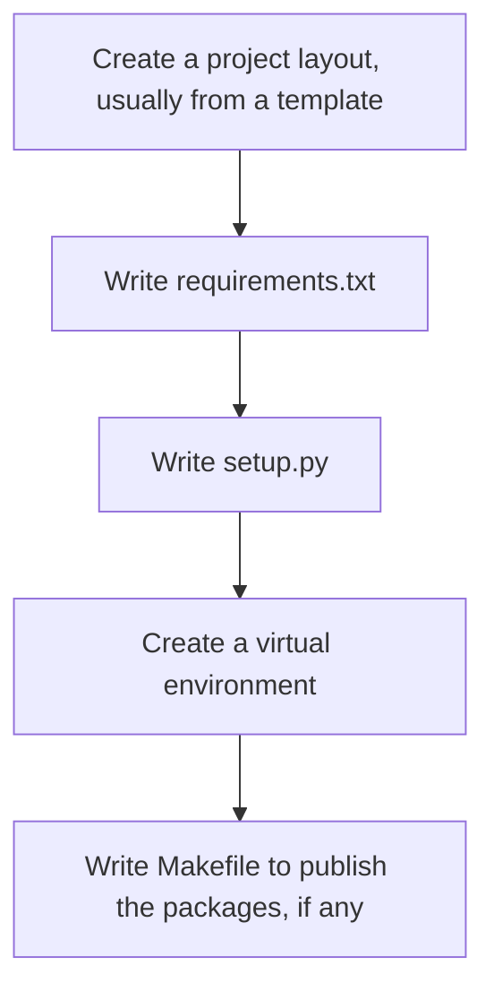
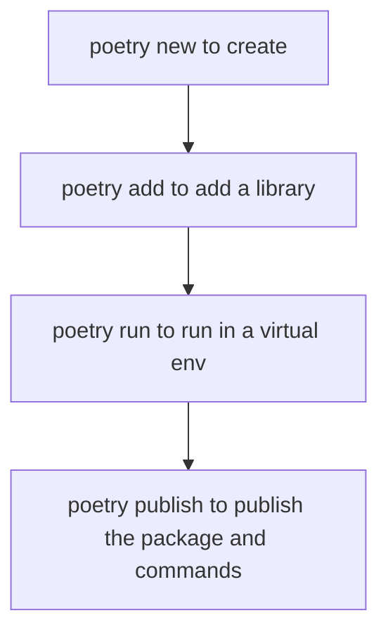

## Using Poetry 

Usually, this is the process that we used to develop:



This process used to involve the following tools:

1. mkvirtualenv
2. pip
3. twine
4. setup.py

Now, instead of all these, we can use just `poetry` (https://python-poetry.org/docs/).



Here are the steps you need to do, to develop code:

## Create a new project

1. `poetry new myproject` will create a project called `myproject`. 
2. Edit the README.md to add at least the intent of the project. You can fill it in as you go along.
3. Write `Makefile` optionally, for others so that they do not have to memorize the commands and options to use with poetry. **TODO: Not yet standardized**
4. Add whatever standard libraries you need by running poetry add, for instance for typer `poetry add typer` 

To add local packages, you need to do something more. We have setup two repos for you:

* pypi -- `https://pypi.aganitha.ai/simple` is for the production setup. Please do not upload your packages there. Soon, we will configure to be read only. 
* dev-pypi -- `https://dev-pypi.aganitha.ai/simple` is for anybody to upload and use in their projects. We will describe the naming structure later.

If you read the portry guide given at https://python-poetry.org/docs/repositories/, you will know how to do this. Here it is succinctly:

```bash linenums="1"
poetry source add --secondary prod https://pypi.aganitha.ai/
poetry source add --secondary dev https://dev-pypi.aganitha.ai/
# Note that if your password contains characters that shell interprets, escape with \. 
poetry config http-basic.prod <username> <password>
poetry config http-basic.dev <username> <password>
```

Now, you can add the package to your project, all you need to do is: `poetry add myprivate-pacakge-name`. It will search in the official repos and then the secondary repos. 
!!! info
    What if you want to add a package only from the dev-pypi? `poetry add --source dev myprivate-pacakge-name` makes it explicit where you want to install from. 

## Making your project available to others

You can publish either your library or command to be available for others in the following way:

```bash
# To add a repo called dev
poetry config repositories.dev https://dev-pypi.aganitha.ai
# To publish to that repo after building
poetry publish --build -r dev
```

This ofcourse publishes your package -- it can be library as well as commands. To make a command, learn the syntax from https://python-poetry.org/docs/pyproject#scripts

## Using the repos with pip

We use poetry to manage and work with projects. It uses pip underneath. Suppose we add a package with a command. How do we use pip to install that package to get that command?

Here are the steps:

1. Create .netrc file in your home folder as follows
    ```
    machine dev-pypi.aganitha.ai
    login <yourldapname>
    password <yourldappassword>
    ```
    Do not forget to change the permissions to 600 on this file.
2. Add this to your .zshrc: `export PIP_EXTRA_INDEX_URL=https://dev-pypi.aganitha.ai/`. 
3. Now you can do `pip install atk-private-package` for instance. 

## Package naming conventions

For the repositories:

1. The `dev` pypi is free to use for all. Feel free to upload the packages for any project in there for others to use.
4. The `prod` pytpi is meant for automated builds. That means, they can only be updated if we change the version number. With dev packages, no backward compatibility is assumed.
5. For production, we are going to allow only automated builds populating it. We are working on the process now.

For package naming: 

1. All the packages shall be named with the prefix `atk-`. Try to make the package useful for all, by relying only on `atk-` and public ones. If you want to check in a project specific package, use the prefix `atk-prj`, with suitable project name. Try not to make it too long, as it becomes error prone.
2. A top level package is not split up across projects. That is, you cannot have `atk-prj/pkg1` in one folder and `atk-prj/pkg2` in another folder. Either pacakge all of them as `atk-prj` or, name them as `atk-prj-pkg1` and `atk-prj-pkg2`.
3. All the commands will be named as `atk-`. 

For training, these are the guidelines:

1. You will name your packages as `atk-training-<yourname>-p<projectname>` 
2. You will name your commands as `atk-yourname-<cmdname>`

## Test tasks

Test your understanding by doing the following:

1. Create a new package atk-yourname-helloworld. 
2. Create a library in the same folder that provides a function called "say_hello".
3. Publish the library to dev.
4. Create a new project called `atk-training-yourname-test1`.
5. In that project add the library you published.
6. Create a command that called atk-yourname-helloworld that says hello world. 
7. Publish it to dev
8. Install on a different machine. And, run the command.
